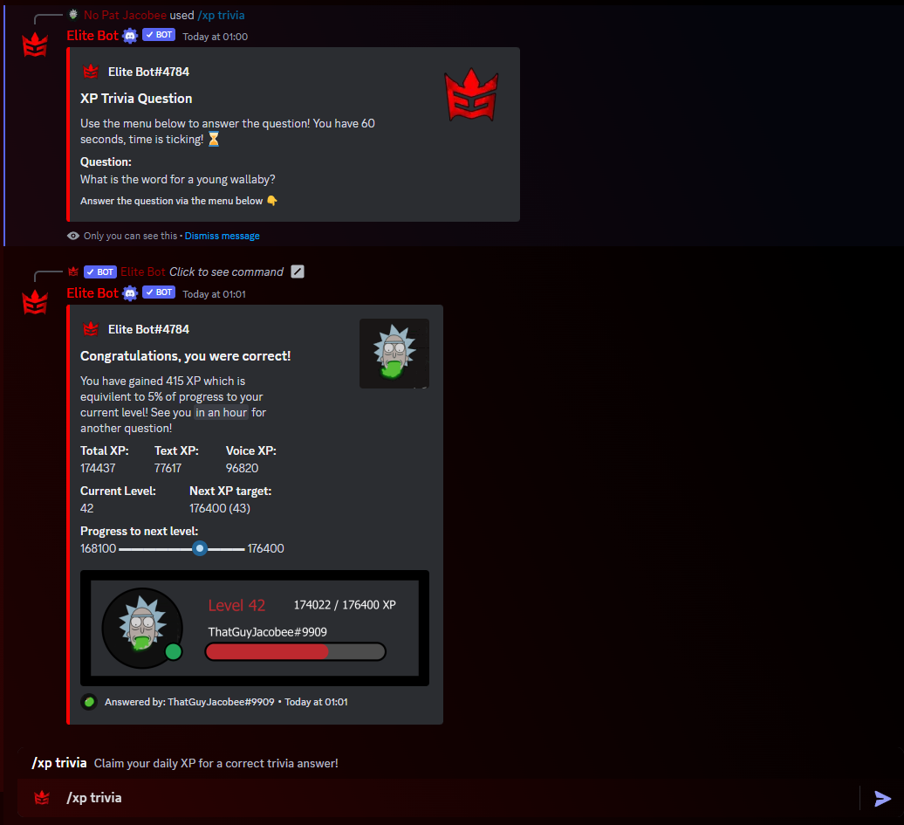

This is not a drill, nor an April Fool's prank! ⚠️ ⚡

After a long period of development, I am pleased to announce that the XP System V2 is now out! 🎉

This update has been written up from the grounds up to entirely re-work the XP System. There is a wide range of new features, improvements and system optimisations that this update has brought to Elite Bot's XP System. Check out this blog post for further in-depth information! 🤓

<!--truncate-->

## Key Additions & Improvements 

In this section, I will summarise the key additions and improvements! Please check our [Discord Server](http://discord.elitegami.ng) for a fully-fledged update log which will be found within the #📢｜eb-updates channel soon:tm:!

### New User Commands

The first addition to the XP System is the **/xpdaily** command. As you can probably assume, this command allows members in your guild to claim XP every 24 hours. The bot will provide 5% of the member's next level progress each time it is run (of course with a 24h cooldown)! See for yourself below on how this command looks. 😎 ⏰

Following this, I have also worked on the new **/xptrivia** command. This will allow the user to begin a random trivia question challenge which they can attempt every hour. Once it is run, the bot will return a randomly generated trivia quesiton followed by 4 potential answers which you can choose via the selection menu! If the user is correct, they will gain 5% progress towards their next level, otherwise they are wrong and will receive nothing. Have a look below! 🙋‍♂️🤔

### Improvements to existing Commands

One great improvement has been to the **/xpcurrent** command which has seen a massive overhaul in the 👀 department, as well as of course useful stats and a nice image that you can easily share around! The command will now show a wide range of useful information including the image which you can share if you wish! See below to take a look 😁

Another big improvement is to the **/xpleaderboard** command, which now has the option to show the top 100 members in your guild based on their total XP! Once the command is used, the user can use the buttons below it to switch between pages, going all the way up to the top 100.

Another much needed improvement is to the admin XP commands, **/xpadd** and **/xpremove** which were previously lacking functionality to decide between adjusting Chat XP or Voice XP. I can happyily say that this has been fixed, both commands now give the option to either adjust Chat XP or Voice XP based on a new parameter in the command.

Last but not least, the **/xprewards** command has also had a small glow up to look and scale better, nothing big but a small touch up as it was already great.

### Misc. & Bug fixes

Well since the XP System was entirely re-worked from scratch, there have been a wide range of fixes and improvements with the previous obsolete code. 

Most importantly, the new system fixes a big issue which was with the level system, where due to primary reliance on it within the database, levels would never go down or adjust based on admin XP adjustments etc. This meant that if you were to gain many levels for example, each time that user posted a message it would send level up messages one by one... this was extremely inefficient and as you can tell a n00b move but it makes sense as it was one of the first things I coded for Elite Bot.Instead, the new System correctly checks and removes the reliance on the level field in the database, as where it is needed, it is calculated which means that everything will always be up-to-date and previous flaws of the original system have been revoked.

Other notable bug fixes include preventing bots in gaining Voice XP, fixing loading issues and incorrectly ordered lists with the **/xpleaderboard** command as well as a range of performance improvements through more efficient programming and functions.

Another misc change is that new server owners which toggle on the XP System for the first time will automatically have the default values setup for them. This should reduce the potential for confusion or therefore lack of configuration from them, and should reduce user errors which have been spotted in the database.

## Documentation Changes

Make sure to check out the two relevant XP System pages to learn more about setting the XP System up, and the User commands that are available to your members! Keep in mind, existing users of the XP System don't have to change anything, this update is automatic! ⚡

There have been some changes to the [XP System Configuration Page](../docs/xp-system) page which involves new configuration information as well as fresh tips and changes which imporve the user experience.

Likewise, there have been substantial changes to the [XP System User & Admin Commands](../docs/xp-user-feature) page which shows the brand new commands, as well as improvements to exsiting commands.

## Thanks for reading

That is pretty much it! Thank you for reading this Update Log, let me know if this is a good format on the [Discord Server](http://discord.elitegami.ng)!

*also cough cough* - Make sure to enter the Discord Nitro giveaway that I am hosting in celebration of 500 servers, within the #🎁｜giveways channel 👉 [Support Discord Server](http://discord.elitegami.ng)
