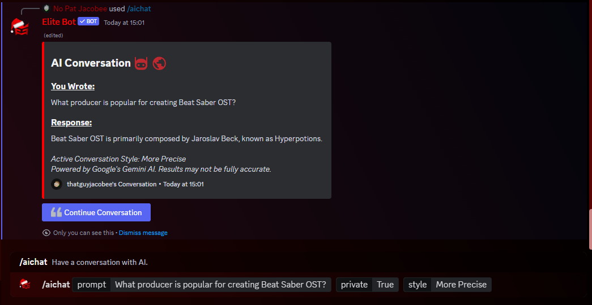
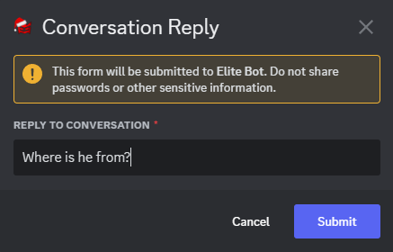
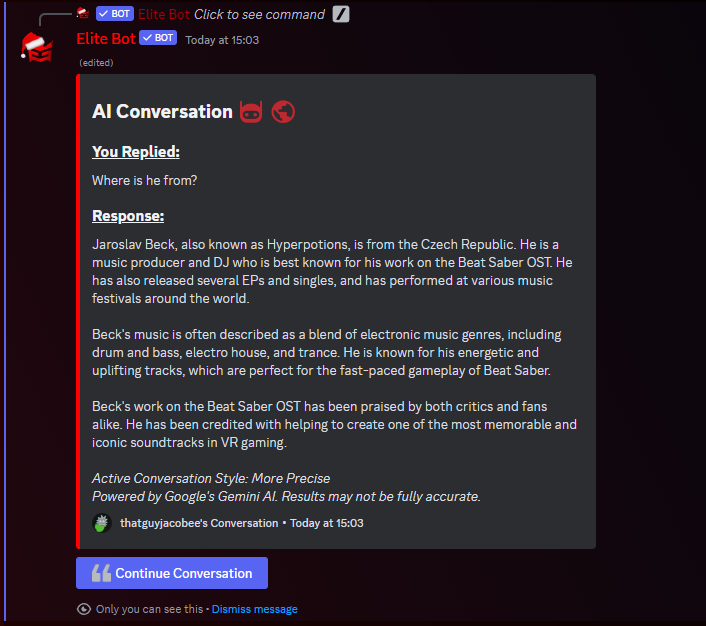

:::note
AI Chat is a new feature, released with update v3.7! This is all free and there are no usage restrictions at this time. 😄

Elite Bot's AI Chat feature is powered by Google's Gemini AI. Results may not be fully accurate.
:::

## How does this work?

You can now use Elite Bot to have a conversation with AI at any time. Simply run the **/aichat** command anywhere with your prompt and quickly receive an awesome reply from the bot. There are a ton of use cases for this... have a question? or perhaps you simply want to summarise some information. No problem, ask the Elite Bot and you will promptly receive a detailed reply.

You can even adjust the privacy mode, as well as the conversation style, to make it either balanced, more creative or more precise.

Once you receive a reply to your command and prompt, you will be able to use the button below the message to continue the conversation and reply directly. This is inclusive of your previous chat history, beginning at the point of command usage, thus you can continue like a regular conversation with the AI!

:::tip
Any chat history is deleted after 15 minutes to protect your privacy. After this period, you will have to run the command again to start a brand new conversation. 🛡️
:::

The main command for this feature is **/aichat** and it has one reqired parameter, which is your prompt. The other two parameters are both optional, the private parameter determines whether the conversation should be public or for your eyes only and the style parameter allows you to select the conversation style. By default, the conversation will be set to public and the style will be set to balanced. Review the command below which provides further information.

| Command        |    Example    |  Usage  |  Permission  |  Timeout  |
| -------------  | :-----------: |  -----  |  ----------  |  -------  |
| /aichat        | /aichat [prompt] Optional: [private] [style] | Have a conversation with AI. | N/A | 15 secs |

## Using AI Chat Feature

First, I will use the command to ask a question. In this example I have specified the conversation to be private and chose the conversation style to be more precise.

You will receive a reply very quickly (couple of seconds maximum). Next, I use the **Continue Conversation** button to ask another question about this topic.

Once again, Elite Bot will promptly reply to your prompt. At any point, the AI will have access to the chat history of this current conversation, which means it can understand previous contexts. For example, in this scenario the AI will understand what you mean by "he" since one of the previous prompts explored this.

:::tip
We do recommend starting a new conversation once you reach around 10+ replies, to ensure that the AI model remains precise and on topic. However, this is not a limit therefore do as you please!
:::

And it is as simple as this! There are no limits for conversation size, nor any usage limits currently imposed for Elite Bot therefore you can use this at any time for free. Enjoy! 🙌
