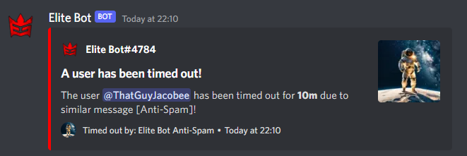

## Toggling the Anti-Spam Feature

By default, the Anti-Spam Feature is toggled off. You can use the "/toggle antispam" command within your guild returning true to enable (or false to disable).

An Example of toggling the Anti-Spam feature:

## Configuring the Anti-Spam Feature

The Anti-Spam feature has multiple configuration options to customise for your needs. Through the "/antispam settings" you can configure how many messages must be set within a specified time (in seconds) to trigger the anti-spam. Additionally, you can set a timegap attribute which specifies the minumum time between messages that the user can send in order to classify as spam.

:::tip

The default values have been thoroughly tested and work well. These are listed in the example screenshot below! :D

:::

An Example of configuring the Anti-Spam feature:

## Toggling additional Text Similarity Anti-Spam

You may also choose to activate the text similarity anti-spam, which checks the sent message with the previous to check if the contents are repeated. This can be toggled using "/antispam similarity" alongise a percentage attribute which refers to how strictly the two previous messages must match (default set to 85% which eliminates most false-positives).

An Example of toggling the Text Similarity Anti-Spam feature:

:::note

All time-outs & Anti-Spam activiations are also logged as long as the Logging Feature is toggled on (using /toggle logging)!

:::

An Example of timing out user based due to Anti-Spam:

And... the Anti-Spam Feature is now fully configured and requires no other configuration.