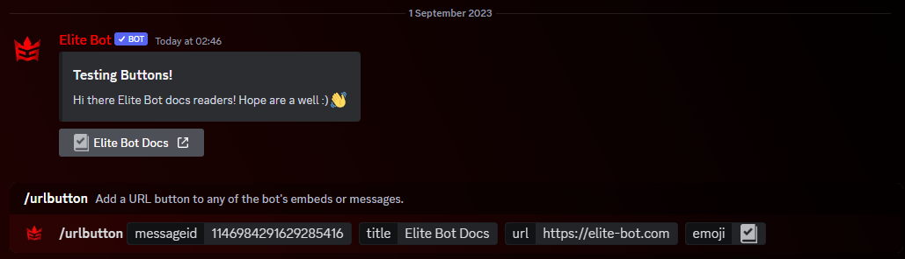

## How does this work?

:::note

Recent update v3.4.2 introduced the ability to add a custom emoji to the button! Use the optional `emoji` parameter within the command :D

:::

Through buttons feature, you can independantly add URL and/or role buttons to ANY of Elite Bot's messages or embeds, making this extremely customisable and useful in many scenarios! There are two utility commands used to attach buttons to any of Elite Bot's message which can be seen in the table below!

| Command        |    Example    |  Usage  |  Permission  |  Timeout  |
| -------------  | :-----------: | -----  |  ----------  |  -------  |
| /rolebutton        | /rolebutton [messageid] [title] [roletogive] Optional: [emoji] | Add a role give/remove button to any of the bot's embeds or messages. | Manage Messages | 10 secs |
| /urlbutton        | /urlbutton [messageid] [title] [url] Optional: [emoji] | Add a URL button to any of the bot's embeds or messages. | Manage Messages | 10 secs |

:::tip

Fun fact: The maximum amounts of buttons you can attach to a single message is **25**! If you hit this limit, that's pretty wild! 🤯

:::

## Adding buttons to a message

By using the above commands, you can add URL and/or role buttons. The most important part is to get the message ID of the message you want to add a button to. For URL buttons, you must pick a URL via the command which will redirect you to it when a user presses it. Likewise, for the role button you configure what role to give/remove from users, and when a user presses it, they receive the role or have the role removed if they already have it.

An example of adding a URL button & opening link on press to user:

An example of adding a Role button & adding a role on press to user:

:::tip

Unsure on how to get the Message ID of an Elite Bot message or embed? It may be a good idea to follow [Discord's official guide](https://support.discord.com/hc/en-us/articles/206346498-Where-can-I-find-my-User-Server-Message-ID-).

:::