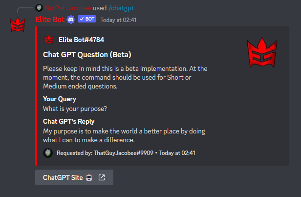
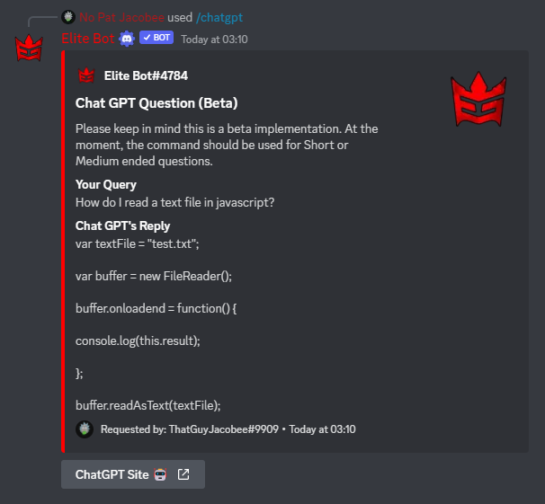
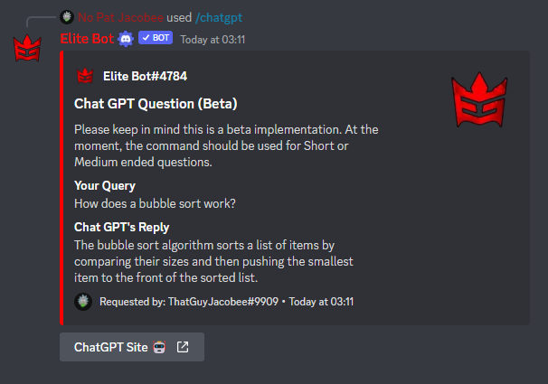
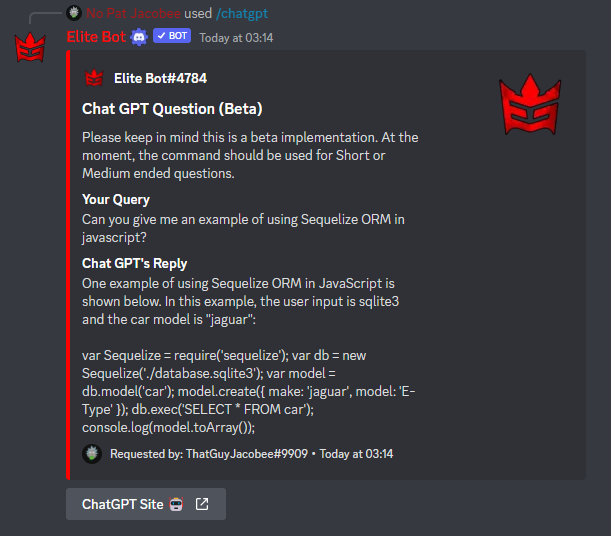

## How does this work?

:::note

The ChatGPT command is one of the latest additions to Elite Bot with update v3.2.2!

:::

The /chatgpt command is standalone and extremely simple to use. All you have to do is run the command and ask a question, and ChatGPT will reply to you. From testing I can tell you AI is extremely interesting and unique! 

| Command        |    Example    |  Usage  |  Permission  |  Timeout  |
| -------------  | :-----------: | -----  |  ----------  |  -------  |
| /chatgpt        | /chatgpt [question] | Ask ChatGPT AI a question 👀 | N/A | 15 secs |

:::tip

Please keep in mind this is a beta implementation. At the moment, the command should be preferably used for Short or Medium ended questions. Link to the official site: https://chat.openai.com/

:::

Examples of asking questions:

