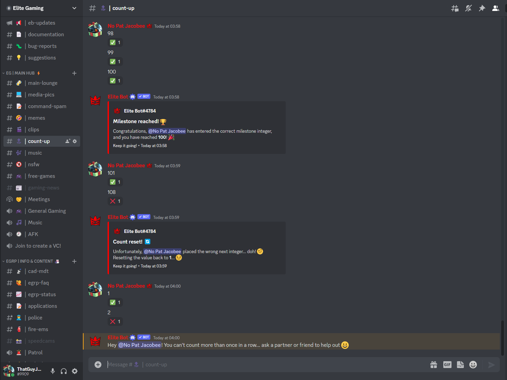

## How does this work?

The counting game is a game where you count... as funny as it sounds 😀. In essence, you first setup the game by setting the channel and a few configuration options including the choice to count up in integers or binary (for a challenge 😎). After it is setup, any user can now count up within the channel to reach milestones, without making a mistake or the same user counting twice in a row if you choose to set it as that. The ultimate aim of the game, is to simply for the community to count as high as they can, with a cross-guild leaderboard coming soon™️ to compete for the highest place!

| Command        |    Example    |  Usage  |  Permission  |  Timeout  |
| -------------  | :-----------: | -----  |  ----------  |  -------  |
| /countgame config   | /countgame config [#channel] [gamemode] [resetwrong] [sameuser] | Change multiple configuration settings for the join roles feature using this command! | Manage Events | 30 secs |

:::tip

Here are the configuration options explained in depth:
-> Gamemode: You can pick for users to count in either integer (1..2..3..etc) or in binary for a challenge (1..01..11..etc).
-> Resetwrong: This is set to true/false and configures whether the count should reset to 0 after a wrong answer.
-> Sameuser: This is also set to true/false and configures whether a same user is allowed to count more than once in a row.

:::

## Playing the game

Once you configure the game, an embed which shows the configured game "rules" will show up. It may be best to pin this message in-case a user needs to see what the rules are. Afterwards, simply begin counting as easy as that!

:::tip

Any non-numerical messages are instantly deleted to prevent clutter. Moreover, messages warning users that they wrote the incorrect next number delete after 15 seconds, unless it's a reset message which will remain as it is important to the game.

:::

An example of the game showing all config options in effect:

