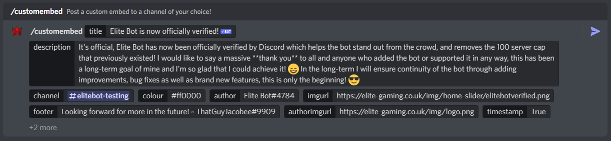
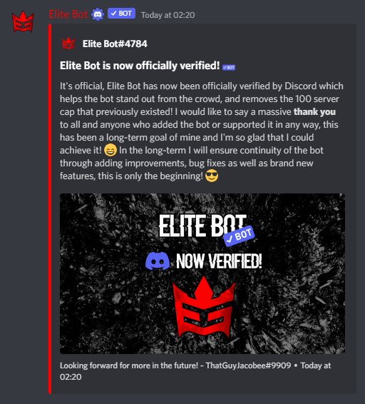

## How does this work?

There are two ways in which you can announce or create posts, the simple method is through the /announce command which provides only 3 parameters. More importantly, you can use the /customembed command which allows you to customise everything about the embed you will send! These can be seen in the table below!

| Command        |    Example    |  Usage  |  Permission  |  Timeout  |
| -------------  | :-----------: | -----  |  ----------  |  -------  |
| /announce        | /announce [#channel] [title] [message] [@ping] | Send an announcement embed to a channel within this guild. | Manage Guild | 30 secs |
| /customembed        | /customembed [#channel] Optional: [title] [description] [#hexcolour] [author] [authorimgurl] [imgurl] [footer] [footerimgurl] [@pingrole] | Post a custom embed to a channel of your choice! | Manage Messages | 30 secs |

:::tip

One of the recent updates has introduced the ability to use "/n" to create new lines! If you wish to create a new line within your description, you can now use "/n" to create a new line at that point!

:::

## Using the custom embed command

The customembed command has one required parameter, the channel. Everything else is optional for you to configure if you wish, otherwise they won't be present in the embed!

An example of customembed command:

A preview of the outcome:

