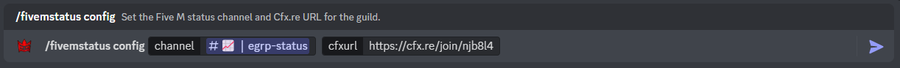

:::important

This feature is useful for Discord servers that run a Five M (GTA V Modification) community or server. If you don't know what Five M is, then you don't need this feature enabled. You can learn more about Five M at: https://fivem.net/

:::

## Enabling Five M Server Status

By default, the Five M Server Status is toggled off. Firstly, use the "/toggle fivemstatus" command within your guild returning true to enable (or false to disable).

An Example of toggling the Five M Server Status:

## Configuring the functionality

Most importantly, fisrt you need to grab your server's IP address or domain name. Next, use the command "/fivemstatus config" which consists of two arguments. One is to define the channel to which the server status embed should be sent to and updated in, whilst the other is the server IP.

:::warning

Ensure that you have the port after your IP, otherwise it will not work! For example: 0.0.0.0:30120 with the port being :30120 (Five M's default port), likewise for domains.

:::

An Example of configurating the Five M Server Status:

:::tip

If you accidentally delete the embed, the embed will automatically be reposted in that same channel!

:::

## Configuring the message embed

Finally, you must customise the embed message to your liking! You can do this through the use of the command "/fivemstatus embed" which conists of two arguments, one for the title and one for the description.

An Example of setting the embed title and description:

:::tip

One of the recent updates has introduced the ability to use "/n" to create new lines! If you wish to create a new line within your description, you can now use "/n" to create a new line at that point!

:::

And... that's it! The Five M Server Status is now fully configured and requires no other configuration. 

:::note

Please note once you submit any of these commands, it may take up to 30 seconds for updates to occur or for the message embed to be posted to the channel.

:::