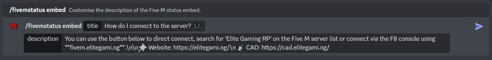

:::important

This feature is useful for Discord servers that run a Five M (GTA V Modification) or Red M (RDR2 Modification) community or server. If you don't know what Five M/Red M is, then you don't need this feature enabled. You can learn more about Five M at: https://fivem.net/ or https://redm.net/

:::

:::note

The latest update brings support to Red M! Configuration is exactly the same requiring the cfx.re URL of your Red M server instead. 🤠

:::

:::note

Recently reworked to v2: This update has changed the previous usage of the IP/Domain:Port to now simply using your server's Cfx.re URL, which improves user privacy and code efficiency. Moreover, a recent update also brings a direct connect button AND a button to view the entire playerlist!

:::

## Enabling Five M Server Status

By default, the Five M Server Status is toggled off. Firstly, use the "/toggle fivemstatus" command within your guild returning true to enable (or false to disable).

An Example of toggling the Five M Server Status:

## Configuring the functionality

Most importantly, first you need to grab your server's Cfx.re URL, which can be found when your start your server in the console, but also through the key management portal at: https://keymaster.fivem.net/. Next, use the command "/fivemstatus config" which consists of two arguments. One is to define the channel to which the server status embed should be sent to and updated in, whilst the other is your server's Cfx.re URL which will be used to find the necessary public data via the endpoint.

:::warning

Ensure that you enter the FULL server Cfx.re URL, including the beginning https! For example: https://cfx.re/join/njb8l4

:::

An Example of configurating the Five M Server Status:

:::tip

If you accidentally delete the embed, the embed will automatically be reposted in that same channel!

:::

## Configuring the message embed

Finally, you must customise the embed message to your liking! You can do this through the use of the command "/fivemstatus embed" which conists of two arguments, one for the title and one for the description.

An Example of setting the embed title and description:

:::tip

One of the recent updates has introduced the ability to use "/n" to create new lines! If you wish to create a new line within your description, you can now use "/n" to create a new line at that point!

:::

And... that's it! The Five M Server Status is now fully configured and requires no other configuration. 

:::note

Please note once you submit any of these commands, it may take up to 15 seconds for updates to occur or for the message embed to be posted to the channel.

:::