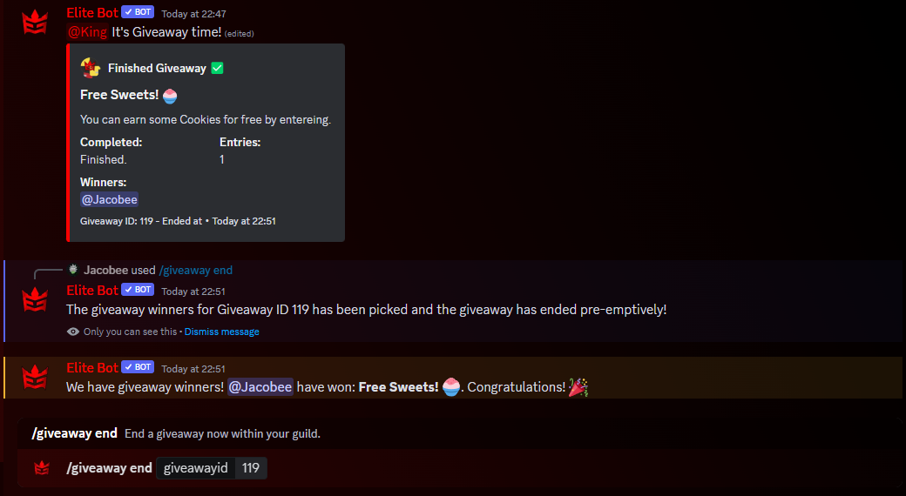

:::note

Recently reworked to v2: This update adds a couple of new parameters for creating giveaways, improves code and provides new textual looks for the giveaway embeds and messages! One headline new option is CAPTCHA verification prior to joining a giveaway to prevent bots, this is on by default. 🎁

:::

## How does this work?

Through the giveaway feature, you can easily create giveaways within your guild, with a range of customisation including timing, requires roles, minimum account age requirements and more! There are total of four utility commands related to giveaways which used to create and manage giveaways within your guild which can be seen in the table below!

| Command        |    Example    |  Usage  |  Permission  |  Timeout  |
| -------------  | :-----------: | -----  |  ----------  |  -------  |
| /giveaway start        | /giveaway start [duration] [prize] [winners] [#channel] [Optional: description/captcha/accountage/serverage/requiredrole/pingusers] | Start a new giveaway for your guild. | Manage Events | 30 secs |
| /giveaway edit        | /giveaway edit [giveawayid] [Optional: changeprize/description/winneramount/captcha/accountage/serverage/requiredrole/addtime/subtime] | Edit the prize of a giveaway now within your guild. | Manage Events | 30 secs |
| /giveaway end        | /giveaway end [giveawayid] | End a giveaway now within your guild. | Manage Events | 30 secs |
| /giveaway reroll        | /giveaway reroll [giveawayid] [howmany] | Re-roll a giveaway within your guild. | Manage Events | 30 secs |

## Starting a giveaway

Beginning a giveaway is an easy process, the command requires a duration, prize, winners amount and the channel as essential parameters. The other couple of parameters are all optional to be used if you wish!

An example of starting a giveaway:

## Editing a giveaway

Likewise with the start command, you can edit any part of the giveaway via the appropirate parameter. The most important part is the Giveaway ID, which can be found in the footer of the giveaway embed! You don't have to fill all of them, they are all option so only set a parameter for what you want to edit!

:::tip

You can get the Giveaway ID from the footer of the giveaway embed!

:::

An example of editing a giveaway:

## Ending early & re-rolling a giveaway

The giveaway end command is simple to use, you just require the Giveaway ID as the parameter. 

An example of ending a giveaway early:

The giveaway reroll command is also simple with two parameters, the Giveaway ID and also the amount of winners to re-roll (which can max be the amount of winners).

An example of rerolling a giveaway winner:

