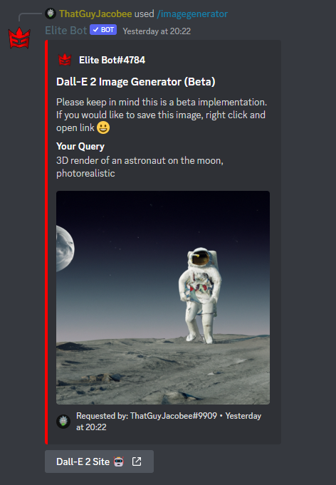
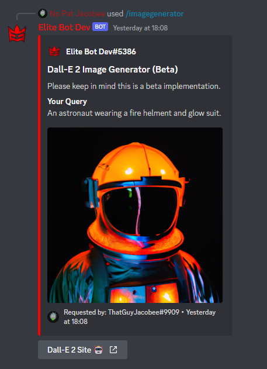
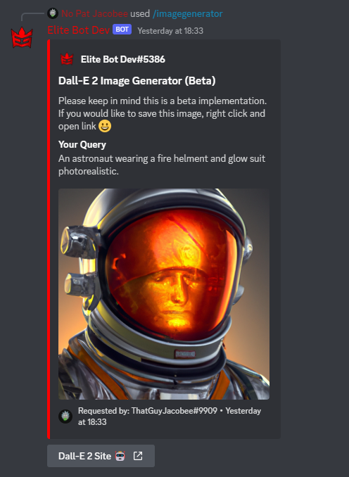

## How does this work?

:::note

The Image Generator command is one of the latest additions to Elite Bot with update v3.2.3!

:::

The /imagegenerator command is standalone and extremely simple to use. All you have to do is run the command and provide a query, and Dall-E 2 will generate an image for you. From testing I can tell you AI is extremely interesting and unique! 

| Command        |    Example    |  Usage  |  Permission  |  Timeout  |
| -------------  | :-----------: | -----  |  ----------  |  -------  |
| /imagegenerator    | /imagegenerator [query] | Ask Dall-E 2 AI to generate an image 👀 | N/A | 60 secs |

:::tip

Please keep in mind this is a beta implementation. Link to the official site: https://openai.com/dall-e-2/

:::

Examples of asking questions:

