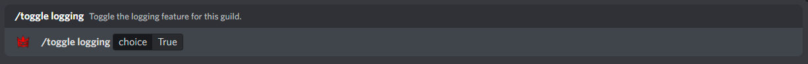
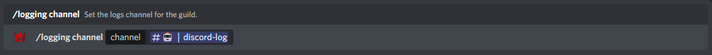

## Enabling Logging Feature

By default, the logging feature is toggled off. Firstly, use the "/toggle logging" command within your guild returning true to enable (or false to disable).

An Example of toggling the XP System:

## Configuring the logging channel

Next you need to configure the Logging feature for your guild! You can do this using the "/logging channel" command which had a single argument requiring a channel where logs will be sent to.

An Example of configuring the logging channel:

Examples of the logging embeds:

And... that's it! The Logging feature will now be operational and all logs will be sent to the set channel, including connecting to voice channels, deleting/editing messages, user joins/leaves and many more!.