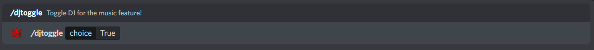

:::warning
Major Change: Music has been completely deprecated from the main Elite Bot! You must invite Elite Bot Music as a separate bot!
[Invite Elite Bot Music HERE!](https://discord.com/oauth2/authorize?client_id=528660579208921098&permissions=274881129536&scope=bot%20applications.commands "Discord OAuth2")
:::

## Configuring DJ mode

Setting up DJ mode is very easy. Firstly you must toggle DJ only mode using the "/toggle djonly" command and setting it to either true of false.

An example of toggling the feature on:

Next, select a role which you wish to set as your @DJ role. This is the role that a user will be required to have in order to use any music command if DJ mode is activated. This is done using the "/dj role" command which looks for a role input.

And... that's it! The music feature is now fully configured and requires no other configuration.

:::tip

Remember when the DJ mode is toggled, only people with the selected DJ role will be able to use any music commands. If no role is set, then you will be prompted to do so next time you try use a music command.

:::