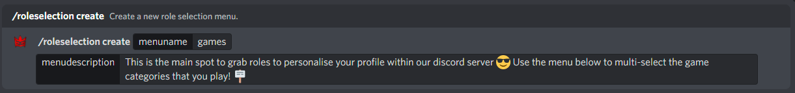
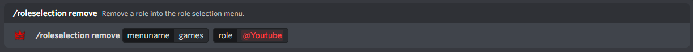
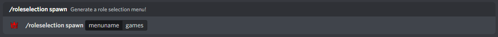

## Managing new and old role selection menus

Firstly, you must create a new role selection menu, with a unique name and description which is used for the embed description. Use the command "/roleselection create" which has two arguments needed, the menu name which must be unique and the menu description which is what the message embed will show.

An Example of creating a role selection menu:

If you are wanting to delete a menu, use the command "/roleselection delete" which requires one argument, which is the menu name that you wish to remove.

An Example of deleting a role selection menu:

:::tip

You can use the command "/roleselection check" in order to see the current role selection names that are currently active within your guild!

:::

## Managing roles within the role selection menu

Adding a role to a role selection menu is relatively easy. Use the command "/roleselection add" which consists of 4 arguments, of which menu name and role are necessary, with the description and emoji being option for extra customisability! Below is a table explaining each.

| Argument Name | Example | Explanation |
| ------------- | :-----------: | ----- |
| menuname | games | This is the name of the role selection menu you want to add a role to. |
| role | @Youtube | This is the role that you want to add. |
| description | This is for Youtube streamers | Optional: This is the description for the role which will show within the role selection menu. |
| emoji | ▶️ | Optional: You can set an emoji which will show within the role selection menu. |

An Example of adding a role to a role selection menu:

:::note

The emoji can be set to a custom one too! There is no limits currently on the amount of roles per role selection menu.

:::

If you wish to remove a role from a role selection menu, the process is even easier. Use the command "/roleselection remove" which has two arguments, one is the menu name which you want to delete a role from, and the second is the role that you want to remove.

An Example of removing a role from the role selection menu:

## Posting the role selection menu

Finally, you can post the role selection menu ones you've added roles to a menu. Use the command "/roleselection spawn" which has one argument, the menu name that you would like to post. This will create a message embed where users can grab or remove roles from by using the interactive menu.

An Example of posting the role selection menu:

And... that's it! The role selection menu is now fully configured and requires no other configuration.