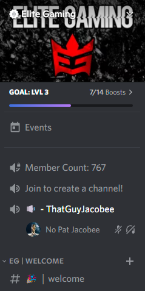

## Configuring the Join to Create VC Feature

By default, the Join to Create VC Feature is toggled off. You can use the "/toggle createvc" command within your guild returning true to enable (or false to disable).

An Example of toggling the Join to Create VC feature:

:::tip

The main voice channel will be automatically created. Once it's created, anyone who connects to it will have their own channel, which they can edit, created. No more need for voice channel clutter!

:::

An Example of the Join to Create VC:

:::note

New Improvement: The created channel now gets deleted when it becomes empty, meaning everyone has left rather than when the owner of the voice channel leaves! :D

:::

And... it's as simple as that, everything else is automatic! The Join to Create VC Feature is now fully configured and requires no other configuration.