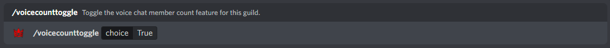
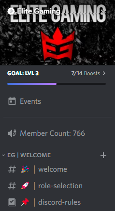

## Configuring the Member Count

By default, the Member Count Feature is toggled off. You can use the "/toggle voicecount" command within your guild returning true to enable (or false to disable).

An Example of toggling the Member Count feature:

An Example of the Member Count VC:

:::note

The channel will be automatically created with no connect permission, ensuring that it's locked and will appear at the top within max 30 seconds of toggling.

:::

And... it's as simple as that, everything else is automatic! The Member Count Feature is now fully configured and requires no other configuration.