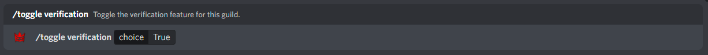
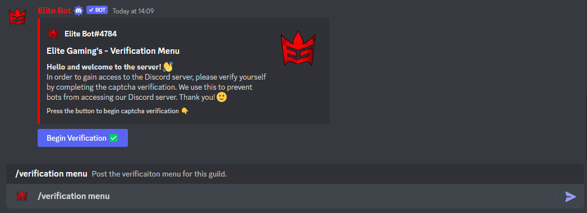
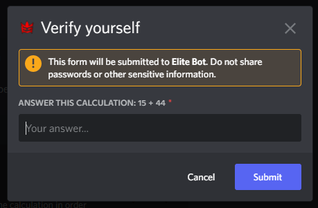

## Toggling the feature

Firstly, you can toggle the feature on using the "/toggle verification" command within your guild returning true to enable (or false to disable).

An example of toggling the feature on:

## Configurating the feature

Next, you have to configure two settings, the description of the embed that is posted and the role that the user should be given if the verification is successful using the "/verificationsettings" command.

:::tip

It's up to you to ensure that the role that you have set in the configuration, is one which grants users access to the rest of the discord. The best way is to deny read and write permissions from @everyone role excluding the verification channel, and the verify role to unlock this.

:::

An example of configurating the two settings:

## Posting the embed

Finally, use the command "/verificationmenu" in order to post the embed into the channel you wish to use for verification.

An example of the embed:

An example of verification step after pressing the button:

:::important

The user will have 60 seconds to answer the calculation, otherwise the modal will close and a too slow message will show.

:::

And... that's it! The verification system is now fully configured and requires no other configuration.