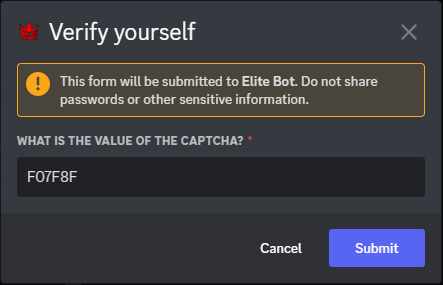

:::note

Recently reworked to v2: This update was entirely recreated from scratch, and now offers captcha functionality which significantly improves security of your server and prevents bot accounts to a much greater effectiveness. As per Google's data, captcha is 99.8% accurate 😏

:::

## Toggling the feature

Firstly, you can toggle the feature on using the "/toggle verification" command within your guild returning true to enable (or false to disable).

An example of toggling the feature on:

## Configurating the feature

Next, you have to configure two settings, the description of the embed that is posted and the role that the user should be given if the verification is successful using the "/verification settings" command.

:::tip

It's up to you to ensure that the role that you have set in the configuration, is one which grants users access to the rest of the discord. The best way is to deny read and write permissions from @everyone role excluding the verification channel, and the verify role to unlock this.

:::

An example of configurating the two settings:

:::tip

One of the recent updates has introduced the ability to use "/n" to create new lines! If you wish to create a new line within your description, you can now use "/n" to create a new line at that point!

:::

## Posting the embed

Finally, use the command "/verification menu" in order to post the embed into the channel you wish to use for verification.

An example of running the command and creating the embed:

An example of the captcha embed after pressing begin verification button:

An example of verification prompt after pressing the verify button:

:::tip

Users can close the verification prompt screen, to see the captcha again without losing already-typed contents, making this easy! You may also press the original begin verification button if you wish to see a new captcha.

:::

Once the user submits the prompt, if the captcha answer is correct then they will receive the role configured previously, otherwise they are returned with an error to try again! And... that's it! The verification system is now fully configured and requires no other configuration.