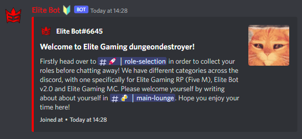

## Enabling the Welcome Feature

By default, the Welcome feature is toggled off. Firstly, use the "/welcometoggle" command within your guild returning true to enable (or false to disable).

An Example of toggling the Welcome feature:

## Configuring the Welcome Feature

Next you need to configure the Welcome Feature for your guild! 

Firstly, use the "/welcomechannel" command which conists of one argument which should be the channel you wish the bot to send user join messages to!

An example of setting the welcome channel:

Next, use the "/welcomeembed" command which consists of two arguments, one being the title that the welcome embed message should have, and the second being the description that the welcome embed message should be set to.

An example of setting the welcome embed:

And... that's it! The Welcome Feature is now fully configured and requires no other configuration.