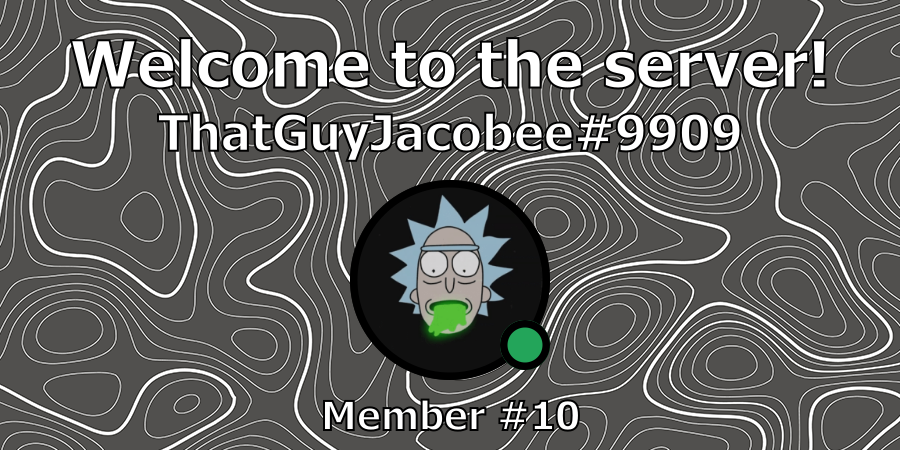

:::note

Recently reworked to v2: One of the latest update has brought new improvements to this feature including image graphics and improved customisation! 🔥 Check out [the blog](../blog/welcome-feature-v2) for more detail!

:::

## Enabling the Welcome Feature

By default, the Welcome feature is toggled off. Firstly, use the "/toggle welcome" command within your guild returning true to enable (or false to disable).

An Example of toggling the Welcome feature:

## Configuring the Welcome Feature

Next you need to configure the Welcome Feature for your guild! There are a few options that you can pick from. 

From the parameters, you must select a channel which you wish to set as your welcome channel. The other three parameters are options. You can if you wish set an embed title, description and also select an image if you wish to show a fun image graphic within the embed!

You can use the "/welcome config" command which conists of the four arguments allowing you to set it up just as you like it!

An example of setting the welcome channel:

:::tip

You can use `{username}` within the title field if you wish to include the user's username as part of the title. You can also use "/n" to create new lines within your description.

:::

## Available image selection

Below you can view all of the images that are currently available to select when configuring your feature.

#### Elite Bot's Background

#### Waterfall & Fog

#### Galaxy

#### Topology Pattern

#### Rocket Launch

#### Destiny 2 - Traveller

#### Destiny 2 - Lightfall

#### Destiny 2 - In memory of Commander Zavala (RIP Lance Reddick)

And... that's it! The Welcome Feature is now fully configured and requires no other configuration.