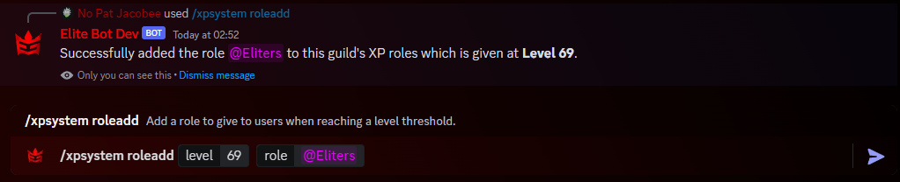

:::note

Recently reworked to v2: One of the latest update has brought **major** changes to the XP system and features! 🔥 Check out the blog for more detail! 

If you are looking for User XP commands and Admin XP commands, please see the [user commands section](xp-user-feature)!

:::

## Enabling the XP System

By default, the XP System is toggled off. Firstly, use the "/toggle xpsystem" command within your guild returning true to enable (or false to disable). Once this is toggled on, the default values for your XP System will be applied. If you would like to change these and also add an AFK Voice Channel, ensure to follow the next step!

An Example of toggling the XP System:

## Configuring the XP System

Next you need to configure the XP system for your guild! You can do this using the **/xpsystem settings** command alongside 6 arguments that you must fill in. Below is a table describing each.

| Parameter Name | Default Values | Explanation |
| ------------- | :-----------: | ----- |
| xptype | Linear or Exponential | Choose whether your levelling system should have levels incremented in a linear fashion (each level requires same amount of XP to the next) or exponential (lvl1=100,lvl2=150,lvl3=375.... higher increments each level)! |
| xpmin | 5 | The minimum threshold of XP that should be given per message and per interval in voice chat. |
| xpmax | 25 | The maximum threshold of XP that should be given per message and per interval in voice chat. |
| xpmultiplier | 50 | This is the multiplier that each level should follow using a logarithmic equation. The higher the number, the more XP will be needed per rank! For example, at multiplier 50, lvl 1 requires 50 XP, lvl 2 requires 175 XP, lvl 3 requires 350 XP. |
| levelupchannel | #🍻main-lounge | This is where level up messages will be posted into one a user reaches the next level threshold. |
| intervalvc | 60 | This is the interval (in seconds!) at which XP is added to a user that is in a voice chat. For example 60 means that every 60 seconds, the user will receive XP whilst in the VC. |
| afkvc | #🕗AFK | This should be set to an AFK channel where gaining XP is blacklisted due to inactivity so no XP is given. |

:::tip

It is recommended that you stick to the default values if you do not know what you are doing. These values are automatically applied when you first toggle the feature on.

:::

An example of setting the XP system settings:

## Configuring role level rewards

:::tip

You can use the command **/xp rewards** in order to check what the current level role rewards are!

:::

An additional feature, is to give roles to users once they cross a certain level threshold. This is very easily configured, using the "/xpsystem roleadd" command. The two arguments for this command are the role to give to the user and the level at which this should occur. Alternatively, you can use "/xproleremove" with a role argument to remove a role reward.

An example of adding an XP Role reward:

And... that's it! The XP System is now fully configured and requires no other configuration.

:::note

There are many more commands that can be used within the XP System including leaderboards and more! Check these out within the [user commands section](xp-user-feature).

:::