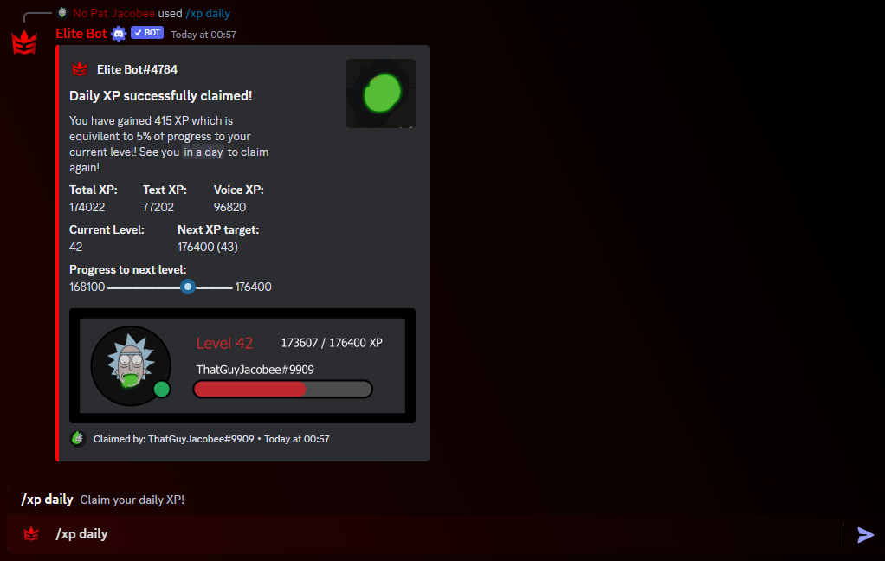
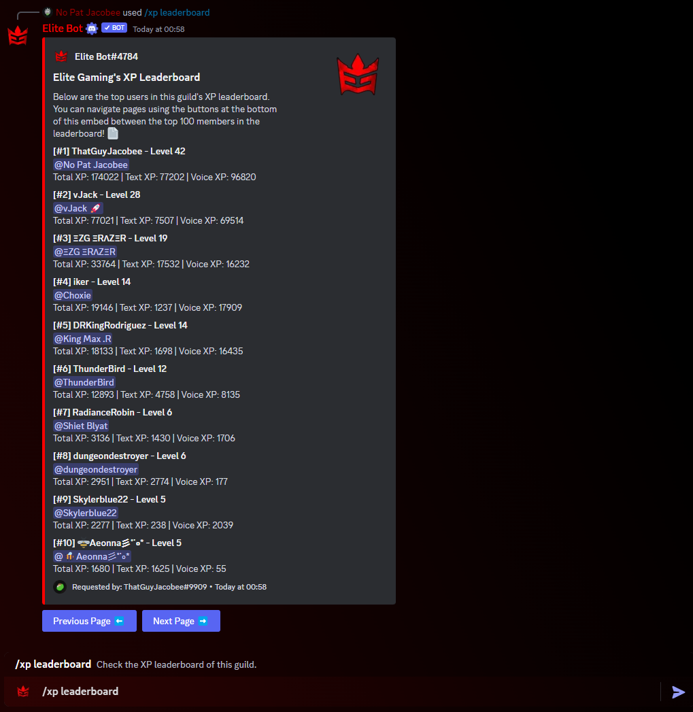

:::note

Recently reworked to v2: One of the latest update has brought **major** changes to the XP system and features! 🔥 Check out the blog for more detail!

:::

## How does this work?

The XP system has a range of commands for users to users and admins to use. There are 3 user commands and an additional two for admins to user, which can be seen in the table below!

| Command        |    Example    |  Usage  |  Permission  |  Timeout  |
| -------------  | :-----------: | -----  |  ----------  |  -------  |
| /xpcurrent        | /xp current [@user] | Check the XP of any user in the guild. | N/A | 15 secs |
| /xpdaily        | /xp daily | Claim your daily XP! | N/A | 15 secs |
| /xpleaderboard        | /xp leaderboard | Check the XP leaderboard of this guild. | N/A | 15 secs |
| /xprewards        | /xp rewards | Display the role rewards for this guild. | N/A | 15 secs |
| /xptrivia        | /xp trivia | Claim your daily XP for a correct trivia answer! | N/A | 15 secs |
| /xpadd        | /xpadd [@user] [type] [amount] | Add XP to a user in your guild. | Moderate Members | 15 secs |
| /xpremove        | /xpremove [@user] [type] [amount] | Remove XP to a user in your guild. | Moderate Members | 15 secs |

:::tip

The daily XP command can be accessed only once per 24 hours, whilst the trivia XP command can be accessed once per hour.

:::

## Using User XP commands

There are five user commands for XP, these are:
- /xpcurrent which checks the XP of any user.
- /xpdaily which allows the user to claim bonus XP every 24 hours.
- /xpleaderboard which allows the user to view the top 100 users in the server. 
- /xprewards which shows the rewards that the guild currently has set.
- /xptrivia which allows the user to attempt a random trivia question every hour to gain XP.

An example of XP Current command:

An example of XP Daily command:

An example of XP Leaderboard command:

An example of XP Rewards command:

An example of XP Trivia command:

## Using Admin XP commands

There are two admin commands used to adjust/modify any user's XP. If you are looking for configuration options, please see the [bot setup section](xp-system). 

- /xpadd which adds XP to the target user.
- /xpremove which removes XP from the target user.

Both commands have three parameters, firstly the target user that you want to adjust XP for, the type of XP (either Chat or Voice) that you want to adjust and finally the amount of XP to adjust by.

:::tip

Remember both of these commands require Moderate Members permission, otherwise they will be inaccessible by default!

:::

An example of adding XP:

An example of removing XP:

